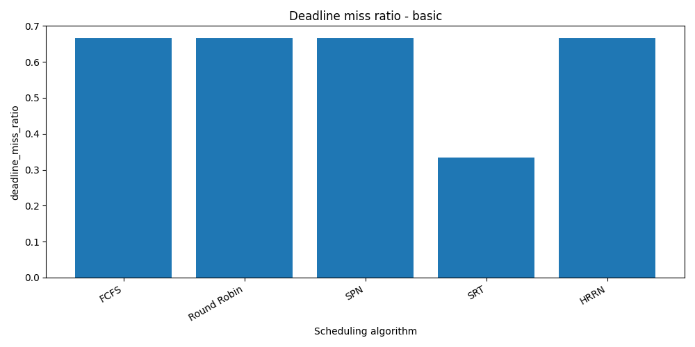
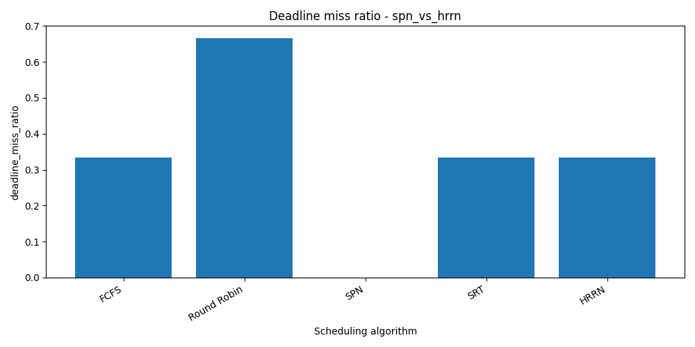
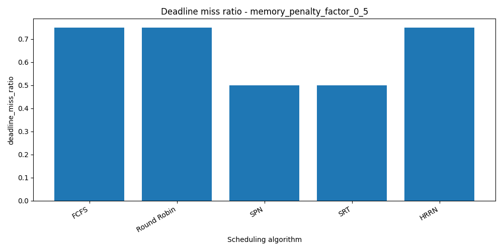
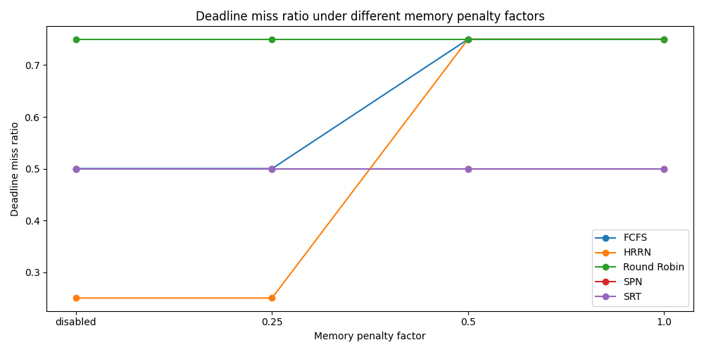
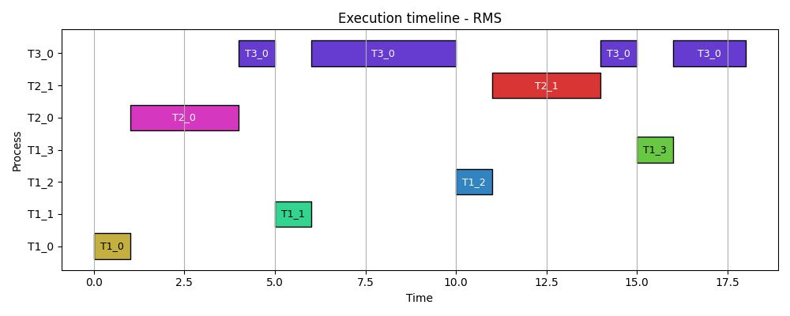

# Scheduling Deadline Simulator - outline seminarskog rada

## 1. Uvod

Cilj projekta je implementacija simulatora CPU scheduling algoritama i analiza njihovog ponašanja u workload-ima sa deadline-ovima.

Poseban fokus je na real-time merama:

- deadline miss count
- deadline miss ratio
- average waiting time
- average turnaround time
- average response time

Projekat dodatno uvodi model sporijeg/udaljenog memorijskog tier-a kroz memory penalty model, kako bi se analiziralo kako povećano efektivno vreme izvršavanja procesa utiče na scheduling rezultate.

Simulator podržava i preiodične real-time taskove kroz RMS algoritam.

## 2. Teorijska osnova

### 2.1 CPU scheduling

CPU scheduling je mehanizam koji OS sistem odlučuje koji proces dobija procesor u određenom trenutku.

U radu se analiziraju sledeći algoritmi:

- FCFS
- Round Robin
- SPN / SJF
- SRT
- HRRN
- RMS
- EDF

### 2.2 Real-time sistemi i deadline-ovi

Kod real-time sistema nije dovoljno posmatrati samo prosečno vreme čekanja ili prosečno vreme izvršavanja.

Važno je da li se zadatak završava pre zadatog roka.

Zbog toga se uvode mere:

- deadline miss count
- deadline miss ratio

Deadline miss označava situaciju u kojoj proces završi posle svog deadline-a.

### 2.3 Preemptive i non-preemptive algoritmi

Non-preemptive algoritmi ne prekidaju proces kada jednom dobije CPU:

- FCFS
- SPN
- HRRN

Preemptive algoritmi mogu prekinuti trenutno izvršavanje procesa:

- Round Robin
- SRT
- RMS

Gantt/Timeline prikaz je posebno koristan za preemptive algoritme jer prikazuje stvarne intervale izvršavanja i prekide procesa.

## 3. Opis implementiranih algoritama

### 3.1 FCFS

FCFS izvršava procese redosledom kojim stižu.

Prednost algoritma je jednostavnost.

Mana je što dugačak proces može blokirati kraće procese koji stižu posle njega.

### 3.2 Round Robin

Round Robin svakom procesu daje vremenski kvantum.

Ako proces ne završi u tom vremenu, vraća se na kraj reda.

Round Robin često daje dobar response time, ali ne garantuje završavanje procesa pre roka.

### 3.3 SPN / SJF

SPN bira najkraći dostupan proces.

Može smanjiti prosečno vreme čekanja, ali nije preemptive, pa ne može reagovati ako kraći proces stigne dok se duži već izvršava.

### 3.4 SRT

SRT je preemptive verzija SPN algoritma.

U svakom trenutku bira proces sa najmanjim preostalim vremenom izvršavanja.

Zbog toga često bolje reaguje u deadline-sensitive workload-ima.

### 3.5 HRRN

HRRN bira proces sa najvećim response ratio:

```txt
response_ratio = (waiting_time + burst_time) / burst_time
```

Ovim se smanjuje rizik od gladovanja procesa koji dugo čekaju.

Međutim, HRRN nije uvek najbolji za deadline-sensitive workload-e, jer može dati prednost procesu koji dugo čeka umesto procesu sa strožim rokom.

### 3.6 RMS

RMS - Rate Monotonic Scheduling algoritam

Koristi se za periodične real-time taskove.

Prioritet se određuje na osnovu periode:

```txt
kraći period = viši prioritet
```

RMS je preemptive fixed-priority algoritam.

Ako stigne instanca taska sa kraćom periodom, ona može prekinuti trenutno izvršavanje taska sa nižim prioritetom.

### 3.7 EDF

EDF je Earliest Deadline First algoritam.

To je preemptive real-time scheduling algoritam sa dinamičkim prioritetima.

Za razliku od RMS-a, koji prioritet određuje prema periodi taska, EDF u svakom trenutku bira proces ili task instancu sa najranijim apsolutnim deadline-om.

Pravilo je:

```txt
raniji deadline = viši prioritet
```

EDF je koristan za poređenje sa RMS-om jer predstavlja drugačiji pristup real-time raspoređivanju:

- RMS koristi fixed-priority pristup,
- EDF koristi dynamic-priority pristup.

U jednostavnim slučajevima, posebno kada su relativni deadline-ovi jednaki periodama, RMS i EDF mogu dati isti raspored. Razlika postaje vidljivija u scenarijima gde taskovi imaju deadline-ove koji se ne poklapaju sa periodama.

## 4. Model procesa i workload-a

### 4.1 Klasični procesi

Klasični workload koristi procese definisane kroz:

- pid
- arrival_time
- burst_time
- deadline
- memory_tier
- memory_intensity

### 4.2 Periodični taskovi

Periodični workload koristi taskove definisane kroz:

- task_id
- period
- execution_time
- relative_deadline
- memory_tier
- memory_intensity

Generator periodičnih taskova od svakog taska pravi konkretne procesne instance.

Primer:
`T1, period = 5, simulation_time = 20`
generiše:

```txt
T1_0 arrival=0
T1_1 arrival=5
T1_2 arrival=10
T1_3 arrival=15
```

## 5. Memory penalty model

Projekat ne simulira konkretan hardverski protkol niti stvarnu memorijsku arhitekturu.

Sporija ili udaljena memorija je modelovana parametarski kroz povečanje efektivnog vremena izvršavanja procesa.

Koriste se 2 vrednosti:

- `base_burst_time`
- `effective_burst_time`

Formula:
`effective_burst_time = ceil(base_burst_time * (1 + memory_penalty_factor * memory_intensity))`

Ako proces koristi lokalnu memoriju, penal se ne primenjuje.

Ako proces koristi udaljeni/sporiji memorijski tier, njegovo efektivno vreme izvršavanja se povećava u zavisnosti od:

- `memory_penalty_factor`
- `memory_intensity`

Ovaj model je pojednostavljena heuristika i služi za kontrolisanu analizu uticaja sporije memorije na scheduling mere.

## 6. Implementacija simulatora

Simulator je implementiran u Python-u.

Glavne komponente:

- modeli procesa i periodičnih taskova
- algoritmi raspoređivanja
- loader za obične workload-e
- loader za periodične workload-e
- generator procesnih instanci iz periodičnih taskova
- računanje metrika
- CSV export
- batch runner za eksperimente
- plotting skripte
- timeline/Gantt prikaz

## 7. Eksperimentalniji scenariji

### 7.1 Basic workload

`workload_basic.json`

Cilj je osnovno poređenje algoritama.

Scenario sadrži procese gde prvi proces ima duže izvršavanje, dok kasniji procesi imaju kraće izvršavanje i strože deadline-ove.

### 7.2 SPN vs HRRN

`workload_spn_vs_hrrn.json`

Cilj je da se pokaže razlika između algoritama koji favorizuje kraće procese i algoritma koji uzima u obzir čekanje procesa.

### 7.3 Remote memory workload

`workload_remote_memory.json`

Cilj je proeđenje rezultata bez memorijskog penala i sa različitim vrednostima `memory_penalty_factor`

### 7.4 Periodic real-time workload

`periodic_tasks_basic.json`

Cilj je prikaz RMS i EDF algoritama nad periodičnim real-time taskovima.

Posebno se posmatra kako se niže-prioritetni task prekida kada stignu instance taskova višeg prioriteta.

Kod trenutnog workload-a, RMS i EDF mogu dati isti ili veoma sličan raspored jer su relativni deadline-ovi jednaki periodama. Zbog toga je kao buduće proširenje korisno dodati poseban scenario koji eksplicitno razdvaja ponašanje RMS i EDF algoritama.

## 8. Rezultati

Rezultati se generišu u CSV fajlovima:

```txt
metrics.csv
schedule.csv
timeline.csv
```

`metrics.csv` sadrži zbirne metrike po algoritmu.

`schedule.csv` sadrži finalne rezultate po procesu.

`timeline.csv` sadrži stvarne segmente izvršavanja procesa i koristi se za Gantt/timeline prikaz.

Za zbirnu analizu koriste se:

```txt
combined_metrics.csv
combined_periodic_metrics.csv
```

### 8.1 Basic workload — deadline miss ratio



### 8.2 SPN vs HRRN workload



### 8.3 Memory penalty scenario



### 8.4 Memory penalty trend



### 8.5 RMS timeline prikaz



## 9. Analiza rezultata

### 9.1 Klasični workload-i

Glavni zaključci:

- Round Robin često daje dobar response time, ali ne garantuje dobar deadline miss ratio.

- SRT se često ponaša stabilno jer može prekinuti duži proces.

- SPN može dati dobre rezultate kada su kraći procesi dostupni u pravom trenutku.

- HRRN smanjuje rizik od gladovanja, ali nije uvek najbolji za deadline-sensitive procese.

- FCFS je jednostavan, ali može loše reagovati kada dugačak proces stigne prvi.

### 9.2 Uticaj memory penalty modela

Povećanje `memory_penalty_factor` povećava efektivno vreme izvršavanja memorjiski intenzivnih procesa.

To može pogoršati:

- average waiting time
- average turnaround time
- deadline miss ratio

Važno je da penalizovani proces ne utiče samo na sebe. Ako duže zauzima CPU, i ostali procesi mogu duže čekati.

### 9.3 RMS i periodični taskovi

RMS pokazuje ponašanje karakteristično za periodične real-time taskove.

Taskovi sa kraćom periodom imaju viši prioritet.

Timeline prikaz pokazuje da task sa dužom periodom može biti prekinut više puta kada stignu instance taskova višeg prioriteta.

### 9.4 EDF i poređenje sa RMS-om

EDF koristi dinamički prioritet zasnovan na apsolutnom deadline-u svake procesne instance.

U trenutnom periodic workload-u EDF može dati isti timeline kao RMS, jer su relativni rokovi jednaki periodama. U takvom slučaju task sa kraćom periodom često ima i raniji rok, pa oba algoritma donose iste odluke.

Ovo nije greška u implementaciji, već posledica izabranog workload-a.

Za jasnije poređenje RMS i EDF algoritama potrebno je dodati scenario gde se perioda i deadline ne poklapaju. Na primer, task sa dužom periodom može imati kraći relativni deadline, što bi EDF-u dalo veći prioritet, dok bi RMS i dalje favorizovao task sa kraćom periodom.

## 10. Gantt / Timeline prikaz

Timeline prikaz je uveden da bi se bolje objasnilo ponašanje preemptive algoritama.

Za svaki segment izvršavanja beleži se:

- `pid`
- `start_time`
- `end_time`
- `duration`

Ovo omogućava prikaz algoritama kao što su:

- Round Robin
- SRT
- RMS

Kod njih procesi ne moraju biti izvršeni u jednom kontinuiranom bloku.

## 11. Ograničenja simulatora

Trenutna ograničenja:

- simulator ne meri stvarno vreme izvršavanja na hardveru
- ne implementira kernel scheduler
- ne modeluje cache ponašanje
- ne modeluje stvarnu NUMA politiku
- ne modeluje migraciju memorijskih stranica
- ne modeluje contention na memorijskom bandwidth-u
- memory penalty model je linearna heuristika
- RMS eksperimenti su ograničeni na jednostavne periodic workload scenarije

Rezultate treba posmatrati kao analizu trendova i relativnih razlika između algoritama, a ne kao precizno merenje realnog sistema.

## 12. Zaključak

Projekat pokazuje da se ponašanje scheduling algoritama značajno razlikuje u zavisnosti od workload-a.

Algoritam koji ima dobre prosečne metrike ne mora imati dobar deadline miss ratio.

Preemptive algoritmi kao što su SRT i RMS mogu bolje reagovati u scenarijima gde je potrebno brzo odgovoriti na dolazak novih zadataka.

EDF proširuje simulator dinamičkim real-time scheduling algoritmom. U kombinaciji sa RMS-om omogućava poređenje fixed-priority i dynamic-priority pristupa periodičnim real-time zadacima.

Memory penalty model pokazuje da sproiji/udaljeni memorijski tier može povećati efektivno vreme izvršavanja procesa i indirektno pogoršati deadline ponašanje celog workload-a.

Trenutna verzija simulatora predstavlja osnovu za dalji seminarski rad i dodatne eksperimente.
